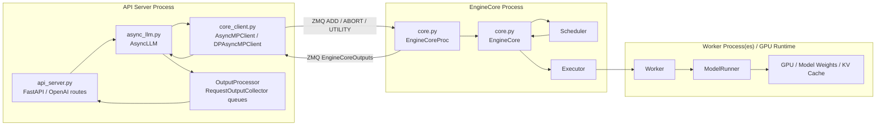
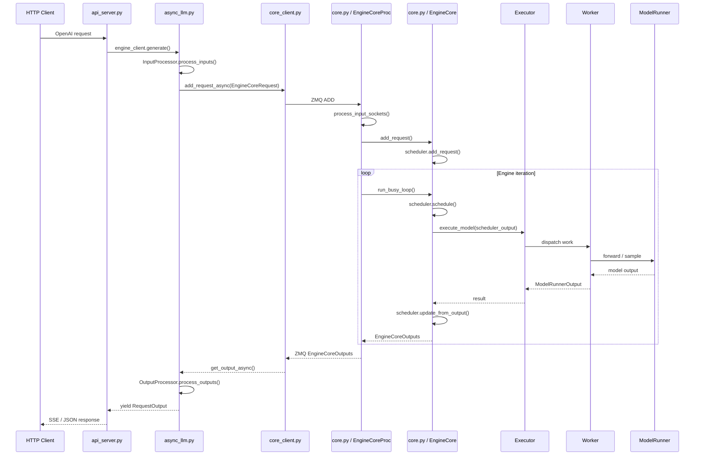

# vLLM 第一天上午学习记录

## 学习目标

今天上午的目标是打通 vLLM V1 serving 路径中最重要的一条主线：

```text
API server -> AsyncLLM -> EngineCoreClient -> EngineCore -> Executor -> Worker -> ModelRunner
```

重点不是细读 scheduler、worker 或 model runner 的内部算法，而是先理解几个入口文件如何配合：

- `vllm/entrypoints/llm.py`
- `vllm/entrypoints/openai/api_server.py`
- `vllm/v1/engine/async_llm.py`
- `vllm/v1/engine/core.py`
- `vllm/v1/engine/core_client.py`

## 已读文件定位

### `vllm/entrypoints/llm.py`

`llm.py` 是 Python offline/synchronous API 入口，面向类似下面的使用方式：

```python
llm = LLM(...)
outputs = llm.generate(prompts)
```

它更偏同步批处理：把 prompts 加入 engine，然后同步推进 engine，最后返回一批 `RequestOutput`。

### `vllm/entrypoints/openai/api_server.py`

`api_server.py` 是 OpenAI-compatible HTTP server 入口，负责启动 FastAPI 服务、解析 CLI 参数、创建 engine client，并把它挂到 app state 中给 OpenAI serving handlers 使用。

在线 serving 路径中，它创建的是 `AsyncLLM`。

### `vllm/v1/engine/async_llm.py`

`async_llm.py` 是在线 serving 的异步前台层。它接收 API server 传来的请求，把 prompt 和参数转成 `EngineCoreRequest`，通过 `EngineCoreClient` 发给后端，并把后端返回的 `EngineCoreOutputs` 分发到每个请求自己的 async stream。

它最关键的两个角色：

- `generate()` / `encode()`：每个请求自己的 async generator。
- `_run_output_handler()`：全局后台 task，持续从 engine core 拉输出并分发到请求队列。

### `vllm/v1/engine/core_client.py`

`core_client.py` 是前台和后端 EngineCore 之间的 client/通信层。它根据运行模式选择：

- `InprocClient`
- `SyncMPClient`
- `AsyncMPClient`
- `DPAsyncMPClient`
- `DPLBAsyncMPClient`

在线 OpenAI serving 主要走 `AsyncMPClient` 或数据并行版本。它通过 ZMQ 发送 `ADD`、`ABORT`、`UTILITY` 消息，并接收后端 `EngineCoreOutputs`。

### `vllm/v1/engine/core.py`

`core.py` 是 V1 后端 engine core 的核心实现。它负责请求预处理、scheduler 调度、executor 执行、输出生成、ZMQ 输入输出、数据并行 wave 协调、elastic EP 扩缩容和 Ray actor 包装。

核心类关系：

```text
EngineCore
  -> EngineCoreProc
      -> DPEngineCoreProc
      -> EngineCoreActor
      -> DPMoEEngineCoreActor
```

## 进程图

下面这张图描述 online serving 路径中几个主要进程/组件的关系：



## 请求生命周期



## 三条核心流程

### 请求进入

```text
HTTP client
 -> api_server.py / FastAPI route
 -> OpenAI serving handler
 -> AsyncLLM.generate() / encode()
 -> InputProcessor.process_inputs()
 -> EngineCoreClient.add_request_async()
 -> AsyncMPClient._send_input()
 -> ZMQ ADD
 -> EngineCoreProc.process_input_sockets()
 -> EngineCore.preprocess_add_request()
 -> input_queue
 -> EngineCoreProc._handle_client_request()
 -> EngineCore.add_request()
 -> scheduler.add_request()
```

### 推理执行

```text
EngineCoreProc.run_busy_loop()
 -> _process_input_queue()
 -> _process_engine_step()
 -> EngineCore.step()
 -> scheduler.schedule()
 -> model_executor.execute_model()
 -> Executor dispatches to Worker
 -> Worker calls ModelRunner
 -> ModelRunner runs forward / sampling on GPU
 -> ModelRunnerOutput
 -> scheduler.update_from_output()
 -> EngineCoreOutputs
 -> output_queue
```

### 输出回流

```text
EngineCoreProc.output_queue
 -> process_output_sockets()
 -> ZMQ EngineCoreOutputs
 -> AsyncMPClient output queue task
 -> AsyncMPClient.outputs_queue
 -> AsyncLLM._run_output_handler()
 -> OutputProcessor.process_outputs()
 -> RequestOutputCollector queue
 -> AsyncLLM.generate() / encode() yield
 -> OpenAI serving handler
 -> HTTP SSE / JSON response
```

## 控制面调用

除了普通请求，`AsyncLLM` 还会通过 `core_client.py` 发起控制面调用，例如：

- `pause_generation()`
- `resume_generation()`
- `reset_mm_cache()`
- `reset_prefix_cache()`
- `add_lora()`
- `remove_lora()`
- `profile()`
- `collective_rpc()`

控制面调用一般走 `UTILITY` 消息：

```text
AsyncLLM control method
 -> AsyncMPClient.call_utility_async()
 -> ZMQ UTILITY(method, args)
 -> EngineCoreProc._handle_client_request()
 -> getattr(engine_core, method)(*args)
 -> UtilityOutput
 -> Future resolved in core_client.py
```

## 检查问题

### 哪个 process 负责 scheduling？

负责 scheduling 的是 **EngineCore Process**。

更具体地说，`core.py` 里的 `EngineCore` 持有 scheduler，并在每轮 `step()` 中调用：

```text
scheduler.schedule()
model_executor.execute_model()
scheduler.update_from_output()
```

`API Server Process` 不做 scheduling，它只是通过 `core_client.py` 把请求发给后端。

### 哪个 process 负责 HTTP streaming？

负责 HTTP streaming 的是 **API Server Process**。

`api_server.py` 中的 OpenAI serving handler 负责把 `AsyncLLM.generate()` 产出的 `RequestOutput` 转成 SSE 或 JSON HTTP 响应。`async_llm.py` 也运行在 API server 进程中，它负责维护每个请求的 async generator 和 `RequestOutputCollector` queue。

所以可以理解为：

```text
EngineCore Process 负责产出 EngineCoreOutputs
API Server Process 负责把 RequestOutput stream 给 HTTP client
```

### 哪个 process 持有 GPU memory 和 model weights？

持有 GPU memory 和 model weights 的是 **Worker / ModelRunner 所在的执行进程或 GPU runtime**。

从这几个文件的视角看：

```text
EngineCore
 -> Executor
 -> Worker
 -> ModelRunner
 -> GPU / model weights / KV cache
```

`EngineCore` 负责调度和调用 `model_executor.execute_model()`，但真正的模型 forward、采样、KV cache 读写、权重和 GPU memory 管理发生在 executor 管理的 worker/model runner 侧。

### offline `LLM` 和 online serving 的路径有什么不同？

offline `LLM` 走的是同步批处理路径：

```text
Python user
 -> LLM.generate()
 -> LLMEngine / EngineCoreClient
 -> 同步 add_request + step/get_output
 -> 返回 list[RequestOutput]
```

它面向本地 Python 调用，通常是“提交一批 prompts，跑完后一次性拿结果”。

online serving 走的是异步 HTTP streaming 路径：

```text
HTTP client
 -> api_server.py
 -> AsyncLLM.generate()
 -> EngineCoreClient.add_request_async()
 -> EngineCore Process
 -> EngineCoreOutputs 回流
 -> AsyncLLM yield RequestOutput
 -> OpenAI handler SSE/JSON streaming
```

它面向并发 HTTP 请求，需要 async generator、请求级 queue、客户端断开后的 abort、后台输出 handler，以及跨进程 ZMQ 通信。

## 类之间的关键区别

### 为什么 DP 会产生多个 EngineCore

在 vLLM V1 里，一个 `EngineCore` 可以理解为一个独立的调度与执行单元：它有自己的 scheduler、请求队列、KV cache 视角和 executor。开启 data parallelism 后，系统会启动多个数据并行 rank，每个 rank 负责一份完整或等价的模型执行副本，用来承接不同请求或不同 wave 的工作。因此前台 client 需要面对多个后端 engine core：每个 DP rank 通常对应一个 `EngineCoreProc` / `EngineCoreActor`，也就是一个独立的 EngineCore。这样做的结果是，DP 不只是“一个 engine 里多几张卡”，而是“多个 EngineCore 共同组成服务后端”；`DPLBAsyncMPClient` 或 DP coordinator 负责在这些 EngineCore 之间选择目标、同步 wave 状态、路由 abort，并收集各 rank 的负载统计。

### `EngineCore` 和 `EngineCoreProc`

```text
EngineCore
= 引擎核心本体
= scheduler + executor + step/update 主逻辑

EngineCoreProc
= EngineCore + 后台进程/ZMQ 输入输出包装
= process_input_sockets / process_output_sockets / run_busy_loop
```

### `EngineCoreProc` 和 `EngineCoreActor`

```text
EngineCoreProc
= 普通后台进程形态

EngineCoreActor
= Ray actor 形态下的 EngineCoreProc
= 额外处理 Ray 环境、设备可见性、地址注入和 actor 生命周期
```

### `AsyncMPClient` 和 `DPLBAsyncMPClient`

```text
AsyncMPClient
= 单个或默认 EngineCore 的异步 ZMQ client

DPLBAsyncMPClient
= 数据并行内部负载均衡 client
= 根据负载统计选择具体 EngineCore
= 维护 request_id -> EngineCore 映射，方便 abort 路由
= 处理 elastic EP 扩缩容通知
```

## 最简心智模型

```text
API server
负责接 HTTP 请求。

AsyncLLM
负责把每个 HTTP 请求变成异步生成流。

EngineCoreClient
负责跨进程通信和 utility RPC。

EngineCore
负责调度和一轮轮执行。

Executor
负责把执行任务派发到 worker。

Worker / ModelRunner
负责真正跑模型 forward、采样、KV cache 等 GPU 工作。
```

## 上午结论

今天上午已经建立了 V1 serving 主链路的整体地图。后续继续深入时，可以沿着下面两个方向展开：

1. 读 `vllm/v1/core/sched/`，理解 `scheduler.schedule()` 如何决定每轮执行哪些 token。
2. 读 `vllm/v1/executor/` 和 `vllm/v1/worker/`，理解 `execute_model()` 如何落到 worker 和 model runner。
